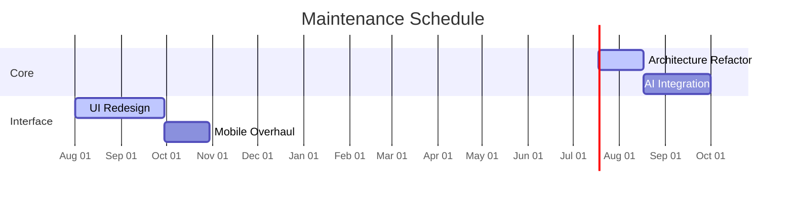

<<<<<<< HEAD
---

=======
# 🚧 UNDER MAINTENANCE 🚧

> Major upgrade in progress - Expect version 5.0 with enhanced AI capabilities

**Status**: `Active Maintenance`  
**Estimated Completion**: 2025-11-20  
**Progress**: 
```diff
+ Completed [██████████░░░░░░░░░░░░] 40%
- Pending  [░░░░░░░░░░░░░░░░░░░░░░] 60%
```

## ⏳ Timeline


## 📬 Contact
For urgent inquiries:  
📧 [email us](mailto:sylivanusmomanyi@gmail.com)  
🐦 [X us](https://twitter.com/silva_african)

💝 [Chat with us](https://wa.me/254755257907)

> ⚠️ Deployment options temporarily disabled during maintenance  
> ℹ️ Last updated: 2025-07-20T14:30:00Z


> ### UNDER MAINTENANCE 

### VERSION 4.0.1

[](https://git.io/typing-svg)


<a href="https://git.io/typing-svg">
  


ᴄʟɪᴄᴋ ᴡᴀ ʟᴏɢᴏ ᴛᴏ ᴊᴏɪɴ sᴜᴘᴘᴏʀᴛ ɢʀᴏᴜᴘ 👇 
<br> [](https://chat.whatsapp.com/Ik0YpP0dM8jHVjScf1Ay5S)
   
<h4 align="center">SILVA SUPPORT GROUP</h1>

---
>>>>>>> a5ad72cbcf4e1685bb7ca81f056aee180f08b9f5
### 🌟 Connect With Me
<p align="center">
  <a href="https://whatsapp.com/channel/0029VaAkETLLY6d8qhLmZt2v"></a>
  <a href="https://instagram.com/_its.silva"></a>
  <a href="https://www.facebook.com/profile.php?id=100055490090211"></a>
  <a href="https://x.com/silva_african"></a>
</p>

<<<<<<< HEAD
---
# Support Silva Tech Inc ❤️

[](https://github.com/sponsors/SilvaTechB)

---

**Empower innovation and creativity!** Become a sponsor of Silva Tech Inc to help us bring more amazing projects to life. Your support makes a big difference.  
👉 [Click here to sponsor us](https://github.com/sponsors/SilvaTechB)


[](https://git.io/typing-svg)


<a href="https://git.io/typing-svg"></a>
  
---

## Silva MD Bot - Enhancing WhatsApp Experience


### We ❤️ Silva MD Bot

<p align="center">
  <a href="https://github.com/DenverCoder1/readme-typing-svg">
    
=======
## 📊 Project Stats

<div align="center">

| Statistic | Badge |
|-----------|-------|
| **Profile Views** |  |
| **Last Update** |  |
| **Repo Size** |  |
| **Stars** |  |
| **Forks** |  |

</div>

---

> A powerful WhatsApp userbot built using the [Baileys](https://github.com/SilvaTechB/Baileys) library.  
> Automate, interact, and explore AI, media tools, reactions, polls, and more!  
> Built with ❤️ by [Silva Tech Inc](https://github.com/SilvaTechB).

<p align="center">
  <a href="https://github.com/SilvaTechB/silva-md-bot">
    
>>>>>>> a5ad72cbcf4e1685bb7ca81f056aee180f08b9f5
  </a>
</p>


<<<<<<< HEAD

---

<p align="center">Introducing Silva MD Bot, designed to bring a whole new level of excitement to your WhatsApp usage.</p>

<p align="center">
  <a href="https://github.com/SilvaTechB/silva-md-bot">
    
  </a>
</p>

## 🎬 Watch the Tutorial

To set up the Silva MD Bot quickly, follow our detailed tutorial on YouTube:
[](https://youtu.be/EXjuKlsASDQ?si=QWYvigE9yjUNGdRP)

---

## Features
- **Auto Motivational Quotes**: Sends motivational quotes in response to viewed statuses.
- **Media Downloader**: Download audio or video from YouTube links.
- **Automated Reactions**: Reacts with emojis to statuses, group mentions, and channel messages.
- **Interactive Polls**: Create "Would You Rather" polls with randomized options.

---

## Deployment Options

### **Fork & Star the Repository**
   - Start by forking this repository and giving it a ⭐ to support Silva Tech!
     To set up the Silva MD Bot quickly, first fork this repository:
     
[](https://github.com/SilvaTechB/silva-md-bot/fork)

### **Pairing the Bot**
   - Visit the bot site to generate a session code.
     

     
      [](https://silva-session-selector.vercel.app/)
    
   - Ensure to delete any existing `creds.json` file if redeploying.

### **Step-by-Step Deployment Guide**

**Option A: Deploy on Heroku**
1. [Create an Account on Heroku](https://signup.heroku.com/) if you haven’t already.
2. Click the button below to deploy directly on Heroku:
   <br>
   <a href='https://silva-md-fork-checker.vercel.app/' target="_blank">
      
   </a>
   
   **Option B: Deploy on Talkdrove**
1. [Sign Up on Talkdrove](https://talkdrove.com/auth/signup).
2. Deploy your app using the button below:
   <br>
   <a href='https://talkdrove.com/dashboard/select-bot/prepare-deployment?botId=95' target="_blank">
      
   </a>
   
**Option C: Deploy on Koyeb**
1. [Sign Up on Koyeb](https://app.koyeb.com/auth/signup).
2. Obtain a [Koyeb API Key](https://app.koyeb.com/account/api) and configure the [DATABASE_URL](https://github.com/SilvaTechB/silva-md-bot/wiki/DATABASE_URL).
3. Deploy your app using the button below:
   <br>
   <a href='https://silva-md-fork-checker.vercel.app/' target="_blank">
      
   </a>

**Option D: Deploy on Railway**
1. [Create an Account on Railway](https://railway.app/login) if you don’t have one.
2. Click the button below to deploy using Railway:
   <br>
   <a href='https://silva-md-fork-checker.vercel.app/' target="_blank">
      
   </a>

---

## Support & Community

<p align="center">Need help? Create an <a href="https://github.com/SilvaTechB/silva-md-bot/issues">issue</a> or <a href="https://wa.me/+254700143167?text=Hello+Silva+Tech,+I+need+assistance+with+Silva+MD+Bot">Contact Us on WhatsApp</a>.</p>

---

## 🎖 Silva Tech Team Members
<details>
<summary>Meet Our Team</summary>

|  |  |  |  |  |  |
| --- | --- | --- | --- | --- | --- |
| [Silva team](https://silva-md-fork-checker.vercel.app/) | [GITHUB](https://github.com/xei-sensei) | [TEAM SILVA](https://github.com/SilvaTechB) | [MANAGER](https://github.com/Sylivanu) | [LAZACK](https://github.com/Lazack28) | [FG98F](https://github.com/FG98F) |

</details>

---

<h1 align="center"> Silva MD Bot 🦾</h1>

<p align="center">
  <a href="https://github.com/SilvaTechB/silva-md-bot">
    
  </a>
</p>

---

### 📜 Table of Contents
1. [About Silva MD Bot](#-about-silva-md-bot)
2. [Features](#-features)
3. [Installation](#-installation)
4. [Usage](#-usage)
5. [How to Contribute](#-how-to-contribute)
6. [Connect with the Developer](#-connect-with-the-developer)

---

### 👾 About Silva MD Bot
**Silva MD Bot** is a multi-functional WhatsApp bot designed for automatic reactions, status updates, motivational quotes, and music/media downloads. Built with the **Baileys API**, it aims to enhance user interaction with custom and automated responses. Whether you want fun interactions in a group, to download media from links, or to get motivational quotes, this bot does it all!

Key features include:
- **Auto-React to Group Messages** with humorous emojis
- **Download Media** (audio/video) from URLs
- **Send Motivational Quotes** in response to status updates
- **Automatically React to Status Updates** with emojis
- **Create "Would You Rather" polls** with shuffling answers
- **Customizable Features**: Easily tweak settings for different bots!

---
### 🚀 Installation

To get started with this project, follow the steps below:

1. **Clone the repository**:
   ```bash
   git clone https://github.com/SilvaTechB/silva-md-bot.git
---

### 💥 Features
- **Automatic Reactions**: React to messages in groups, channels, and even when mentioned by your username with fun and dynamic emojis.
- **Media Downloader**: Download music videos or audio from URLs (such as YouTube) in different formats.
- **Motivational Quotes**: Respond to status updates with a motivational quote instead of a standard message.
- **Interactive Polls**: Create "Would You Rather" polls when prompted with 'wyr' followed by options.
- **Status Auto-React**: Set up reactions to status updates with green hearts or customized emojis.
- **Multi-Functionality**: Designed to automate repetitive tasks on WhatsApp, making interactions smoother and more fun.

---
### 🛠 Usage

Once the installation is complete and the bot is running, you can use the Silva MD Bot in your WhatsApp group or chat. Below are some key features and how to interact with them:

#### 1. **Send a Motivational Quote**
   - When someone views your status, the bot will automatically respond with a motivational quote.

#### 2. **Auto-Reactions to Status Updates**
   - The bot reacts to all status updates with a **green heart emoji** if the feature is enabled.

#### 3. **Music Downloader**
   - Enter a **YouTube song name** or **YouTube link** and choose whether you want the media in **audio** or **video** format.
     - Example: `!download song_name`
     - The bot will then send a button to select the format: **Audio** or **Video**.

#### 4. **Group Reactions**
   - The bot reacts to all messages in your WhatsApp group or channel with random humorous emojis.

#### 5. **Would You Rather Poll**
   - Type `wyr` followed by the bot’s prefix and it will generate a **Would You Rather** poll with two random choices.

#### 6. **Tagging the Owner**
   - Whenever the bot owner is tagged in a group, the bot will respond and react accordingly.

#### 7. **Customization**
   - You can enable or disable certain features like auto-reactions, music downloads, etc., through the bot's configuration file.

For more information on configuring and customizing the bot, refer to the [configuration guide](docs/configuration.md).
---
### 🛠️ Usage
Once you’ve set up the bot, you can begin interacting with it on WhatsApp:

Reactions: Mention the bot or type in a group chat to see automatic reactions.
Media Downloader: Send a media link (e.g., YouTube or SoundCloud) and select the format to download.
Motivational Quotes: Enable status reaction mode to have the bot reply with a quote to every status you view.
Create Polls: Start a "Would You Rather" poll by typing wyr followed by two options.
### 🤝 How to Contribute
We welcome contributions to Silva MD Bot! Here's how you can get involved:

Fork the repository.
Create a new branch for your feature.
Commit your changes.
Push your branch to your forked repository.
Submit a pull request with a detailed description of your changes.
### 🧑‍💻 Connect with the Developer

<p align="center">
  <a href="https://github.com/SilvaTechB">
    
  </a>
  <a href="https://twitter.com/silva">
    
  </a>
  <a href="https://wa.me/message/254743706010">
    
  </a>
  <a href="https://tiktok.com/@silva.edits6">
    
  </a>
</p>
### 📄 License
This project is licensed under the [MIT License](LICENSE) - see the LICENSE file for details.


## ⚠️ Disclaimer

*Silva MD Bot is not affiliated with WhatsApp Inc. Misusing the bot could result in a temporary or permanent WhatsApp ban. Silva Tech is not responsible for any bans or restrictions that may occur.*

---

<p align="center">© Silva Tech 2025</p>
=======
🍴 Fork our repo and star to show love

[](https://github.com/SilvaTechB/silva-md-bot/fork)

 🌐 Get Your Session ID or Creds.json File 
 
[](https://silva-session-selector.vercel.app/)


## 📌 Deploy Now

| Platform | Links |
|---------|--------|
| 🌐 Get Session | [](https://silva-session-selector.vercel.app/) |
| ☁️ Heroku | [](https://silva-md-fork-checker.vercel.app/) |
| 🚄 Railway | [](https://silva-md-fork-checker.vercel.app/) |
| 🌀 Koyeb | [](https://silva-md-fork-checker.vercel.app/) |
| 🧩 Talkdrove | [](https://host.talkdrove.com/share-bot/49) |


## 🧩 Plugins

Boost your bot with external features!  
[](https://github.com/SilvaTechB/EXTERNAL-PLUGINS)


## 💡 Features

- 🎵 Download YouTube videos as **audio or video**
- 💬 Auto-replies + emoji reactions
- 🔄 Auto motivational replies to viewed statuses
- 🧹 Message deletion on keyword detection
- 😄 Group/channel auto-reactions
- 🗳️ Would You Rather polls
- 👀 Read all messages (except exempted users)
- 📲 Manage status and contacts


## 👨‍💻 Developer Support

- 🧠 Need help? [Open an Issue](https://github.com/SilvaTechB/silva-md-bot/issues)
- 📩 WhatsApp Dev Chat: [Chat Silva Tech](https://wa.me/+254700143167?text=Hello+Silva+Tech,+I+need+assistance+with+Silva+MD+Bot)


## 📢 Socials

[](https://whatsapp.com/channel/0029VaAkETLLY6d8qhLmZt2v)
[](https://instagram.com/silva.tech.inc)
[](https://facebook.com/profile.php?id=100055490090211)
[](https://x.com/silva_african)


## 👥 Contributors

|  |  |  |
|---|---|---|
| [Silva](https://github.com/SilvaTechB) | [Shizo](https://github.com/shizothetechie) | [Lazack28](https://github.com/Lazack28) |


## 🔄 People Who Forked and 

[](https://github.com/SilvaTechB/silva-md-bot/network/members)
[](https://github.com/SilvaTechB/silva-md-bot/network/members)


## 📎 License

Licensed under MIT.  
© [Silva Tech Inc](https://github.com/SilvaTechB)

### Silva Md Bot doesn't have version 3

>>>>>>> a5ad72cbcf4e1685bb7ca81f056aee180f08b9f5
